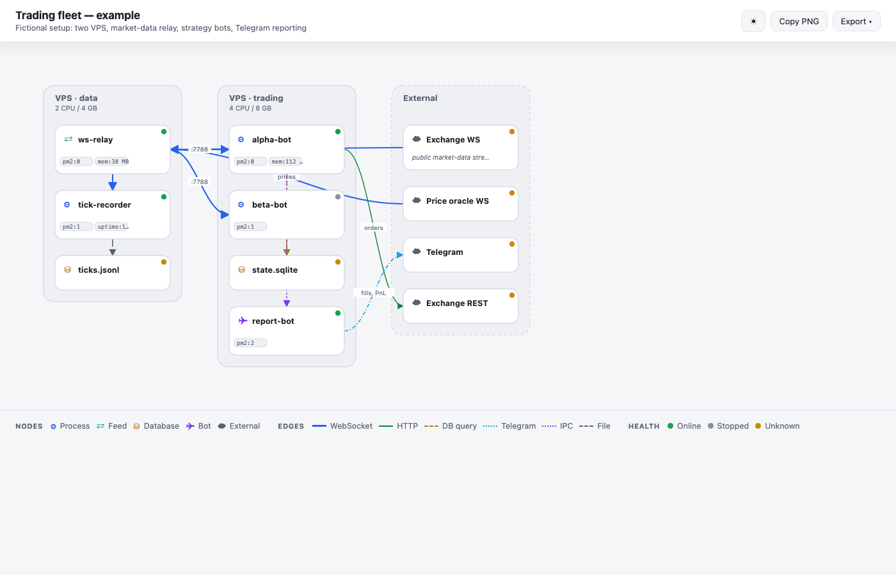

# fleetmap

<!-- TODO: demo GIF (20-40s) -->

Turn a running process fleet into a clean, self-contained architecture diagram — one HTML file, no dependencies, dark/light themes, PNG/SVG export.

**RU:** fleetmap превращает живой набор процессов (pm2/systemd) в самодостаточную HTML-диаграмму архитектуры — один файл, без зависимостей, светлая/тёмная тема, экспорт PNG/SVG. Строит карту по снапшоту `pm2 jlist` или по написанному вручную JSON.

Most diagram tools draw the architecture you *describe*. fleetmap draws the one you actually *run*: point it at a `pm2 jlist` snapshot and it lays out every process, feed, database and bot, grouped by host, with live health colors. Or write the fleet by hand in a small JSON format when you want to document a design.



## Why

If you keep a zoo of long-running processes on one or more VPS — API workers, WebSocket relays, recorders, Telegram bots — there is usually no single picture of what talks to what. `pm2 list` gives you a table, not a map. fleetmap turns the table into a diagram you can read, share, and drop into a README or a Slack thread.

## Quick start

```bash
git clone https://github.com/Sanexxxx777/fleetmap
cd fleetmap

# render a hand-written fleet
node fleetmap/bin/fleetmap.mjs render fleetmap/examples/trading-fleet.json

# or build one straight from a live pm2 host
pm2 jlist | node fleetmap/bin/fleetmap.mjs collect --group-label web-01 --title "web-01" -o fleet.json
node fleetmap/bin/fleetmap.mjs render fleet.json
```

Open the generated HTML. Press `T` to toggle theme, `E` to export. Everything is inline — send the file and it just works.

## The fleet format

A fleet is nodes, optional host groups, and edges:

```json
{
  "title": "web-01",
  "groups": [{ "id": "web-01", "label": "web-01" }],
  "nodes": [
    { "id": "api", "label": "api", "kind": "process", "group": "web-01",
      "health": "online", "meta": { "pm2": "0", "mem": "140 MB" } },
    { "id": "pg", "label": "PostgreSQL", "kind": "database", "group": "web-01" }
  ],
  "edges": [
    { "from": "api", "to": "pg", "kind": "db" }
  ]
}
```

- **nodes** — `process`, `feed`, `database`, `bot`, `queue`, `web`, `external`; optional `health` (`online`/`stopped`/`errored`/`unknown`) and `meta` badges.
- **groups** — hosts. Ungrouped nodes fall into an *External* lane on the right.
- **edges** — `ws`, `http`, `db`, `tg`, `ipc`, `file`; each gets its own line style. `bidi: true` draws both arrows.

Full schema: [`fleetmap/schemas/fleet.schema.json`](fleetmap/schemas/fleet.schema.json).

## Use as an agent skill

fleetmap ships with a [`SKILL.md`](fleetmap/SKILL.md) so a coding agent (Claude Code, Codex CLI, opencode) can build the JSON from your description or from a pasted `pm2 jlist` and render it for you. Ask: *"map this host's fleet with fleetmap."*

## Collector

`collect` reads `pm2 jlist` from stdin (or runs it for you) and maps each process to a node: name → id, `status` → health, and `pm_id` / memory / uptime / restart count into `meta` badges. Edges (what streams to what) are yours to add — the collector gives you the accurate node list to start from.

## Tests

```bash
npm test
```

## Inspired by

The "describe it → validate against a JSON schema → deterministic renderer → single self-contained HTML" approach is borrowed from [tt-a1i/archify](https://github.com/tt-a1i/archify) (MIT). fleetmap is not a fork — it reuses that idea for a different job (live process fleets rather than free-form architecture) with its own schema, renderer, and a pm2 collector. Credit to archify for the pattern.

## Contact

Questions or issues: [github.com/Sanexxxx777](https://github.com/Sanexxxx777).

## License

MIT © Aleksandr Shulgin ([@Sanexxxx777](https://github.com/Sanexxxx777)) (@Aleksandr_NFA)
